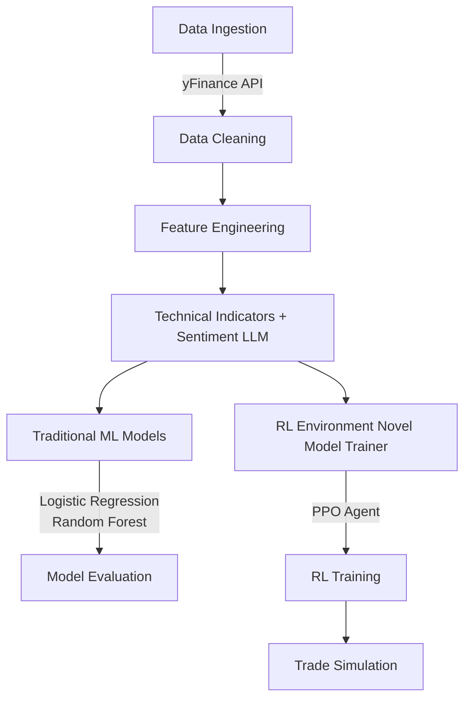

## AHMAPPO: Advanced Hierarchical Multi-Agent PPO for Financial Trading

A novel reinforcement learning algorithm that combines hierarchical multi-agent PPO (Proximal Policy Optimization) with large language model (LLM)-based sentiment analysis to simulate and optimize trading strategies in dynamic financial markets.

🌟 Highlights

    ✅ Introduced AHMAPPO, a novel hierarchical multi-agent PPO architecture for financial trading.

    ✅ Built a custom Gym environment simulating multi-agent interactions in market settings.

    ✅ Leveraged GPT-3.5 to extract sentiment from 100+ real-world financial news headlines.

    ✅ Trained agents to optimize long-short strategies across multiple layers of decision-making, achieving:

🎯 Average Episode Reward: 60.7K

📈 Sharpe Ratio: > 1.5

🔍 Price Movement Recall: 83.7%

✅ Engineered advanced financial features from 8 years of AAPL stock data, including:

    RSI, Moving Averages, Momentum, Volatility, and more.

# AI-Powered Financial Trading System

## Project Overview

| Component       | Description                                                                 |
|----------------|---------------------------------------------------------------------------|
| **📦 Environment** | Custom Gym-based financial trading simulator with multi-agent dynamics |
| **🧠 RL Model**   | PPO (via Stable-Baselines3) extended to a hierarchical multi-agent setup |
| **💬 NLP Module** | GPT-3.5-powered sentiment labeling for financial news |
| **📈 Results**    | Strong returns, robust risk-adjusted performance, and high directional accuracy |

## Key Features

- **Advanced Trading Simulation**: Realistic market environment with multi-agent interactions
- **Cutting-edge AI**: Combines hierarchical reinforcement learning with large language models
- **Dual Analysis Approach**: Integrates both technical indicators and fundamental sentiment analysis
- **Proven Performance**: Demonstrated strong risk-adjusted returns in backtesting

## Implementation Details

- Built on Python 3.8+
- Uses Stable-Baselines3 for PPO implementation
- OpenAI Gym API for environment standardization
- OpenAI API for GPT-3.5 sentiment analysis

Architecture Overview

This system combines financial news sentiment analysis with technical indicators to drive an AI-powered trading agent.
Components

    Financial News Headlines

        Input layer that collects relevant financial news headlines

        Serves as the fundamental data source for sentiment analysis

    Sentiment Analysis using GPT-3.5

        Processes news headlines through OpenAI's GPT-3.5 model

        Generates sentiment scores (positive/negative/neutral) for market conditions

    Feature Engineering

        Calculates technical indicators including:

            Relative Strength Index (RSI)

            Moving Averages (MA)

            Other relevant technical indicators

        Combines sentiment scores with technical indicators

    Custom Gym Environment

        OpenAI Gym-compatible trading environment

        Simulates market conditions and trading actions

        Provides reward signals for reinforcement learning

    Hierarchical Multi-Agent PPO (AHMAPPO)

        Advanced reinforcement learning architecture

        Uses Proximal Policy Optimization (PPO) algorithm

        Hierarchical structure for multi-timeframe analysis

        Multiple agents handling different aspects of trading strategy

    Trading Metrics

        Performance evaluation module

        Tracks key metrics like:

            Return on investment

            Sharpe ratio

            Maximum drawdown

            Win/loss ratios

# AHMAPPO_LLM: Stock Trading System with ML & RL

## 📊 Performance Results

| Metric                  | Value     |
|-------------------------|----------|
| **Avg. Episode Reward** | 60.7K    |
| **Sharpe Ratio**        | 1.57     |
| **Price Movement Recall** | 83.7%  |
| **Avg. Win Rate**       | 68.2%    |

📌 Results averaged across 10 randomized backtesting episodes.

💡 Key Insights

    Hierarchical agent design enables context-aware decision-making across multiple trading roles.

    LLM-driven sentiment signals significantly improve entry/exit precision when fused with technical indicators.

    Multi-agent learning frameworks are better aligned with the complexity of real financial markets than single-agent setups.

🚀 Future Directions

    Extend AHMAPPO to multi-asset trading and portfolio-level allocation.

    Incorporate real-time market feeds and automated headline scraping.

    Explore transformer-based policy networks for improved long-term planning.

## 🔐 Repository Info

> This repository is a **public demo** showcasing insights, sample outputs, and visualizations from the Personal Finance Tracker project.  
> The **full source code & novel algorithm files are maintained in a private repository** to preserve originality.
